<picture>
  <source media="(prefers-color-scheme: dark)" srcset="assets/svg/banner-dark.svg">
  <source media="(prefers-color-scheme: light)" srcset="assets/svg/banner-light.svg">
  
</picture>

<!--
  STREAK STATS -- using the PUBLIC streak-stats.demolab.com, not the
  self-hosted github-readme-streak-stats-livid-xi.vercel.app instance:
  that Vercel deployment 404s intermittently (same domain-instability
  pattern hit on the other self-hosted service), so the public instance
  is the more reliable choice here even though it's shared. Re-point at
  the self-hosted one if it proves stable later.

  The stats + top-langs cards (self-hosted github-readme-stats) were
  here too but kept 404ing on a Vercel domain that wouldn't stay put
  even after redeploys -- pulled for now rather than ship something
  broken. Re-add by restoring these two lines once that instance is
  stable again:
    
    
-->

  

 

<!--
  CONTRIBUTION SNAKE -- only renders once .github/workflows/snake.yml
  has run green at least once (it pushes these two files to the
  `output` branch). See the checklist at the bottom.
-->
<picture>
  <source media="(prefers-color-scheme: dark)" srcset="https://raw.githubusercontent.com/TomasPosada0626/TomasPosada0626/output/snake-dark.svg?v=2">
  <source media="(prefers-color-scheme: light)" srcset="https://raw.githubusercontent.com/TomasPosada0626/TomasPosada0626/output/snake-light.svg?v=2">
  
</picture>

 

<!--
  PROJECTS -- self-hosted card grid (services/project-cards), same
  pattern as the stats block: generated live on every view, ordered by
  most-recently-pushed. Replace YOUR-PROJECTS-INSTANCE once deployed
  (see services/project-cards/README.md).
-->
<b>PROJECTS.LIST</b> &nbsp;<code>./projects.sh --all</code>

<picture>
  <source media="(prefers-color-scheme: dark)" srcset="https://tomas-posada0626.vercel.app/api?repos=TomasPosada0626/cucu%2CTomasPosada0626/Amparo%2CTomasPosada0626/opera%2CTomasPosada0626/Prodexa%2CTomasPosada0626/epsilon%2CTomasPosada0626/Neuroroutine&theme=dark&v=7">
  <source media="(prefers-color-scheme: light)" srcset="https://tomas-posada0626.vercel.app/api?repos=TomasPosada0626/cucu%2CTomasPosada0626/Amparo%2CTomasPosada0626/opera%2CTomasPosada0626/Prodexa%2CTomasPosada0626/epsilon%2CTomasPosada0626/Neuroroutine&theme=light&v=7">
  
</picture>

  

  &nbsp;&nbsp;&nbsp;&nbsp;

